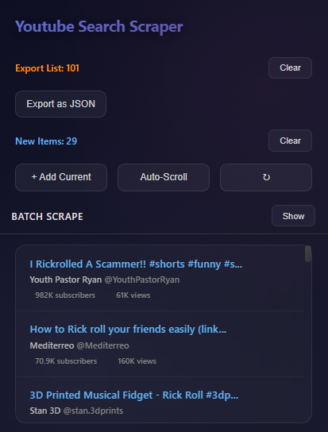
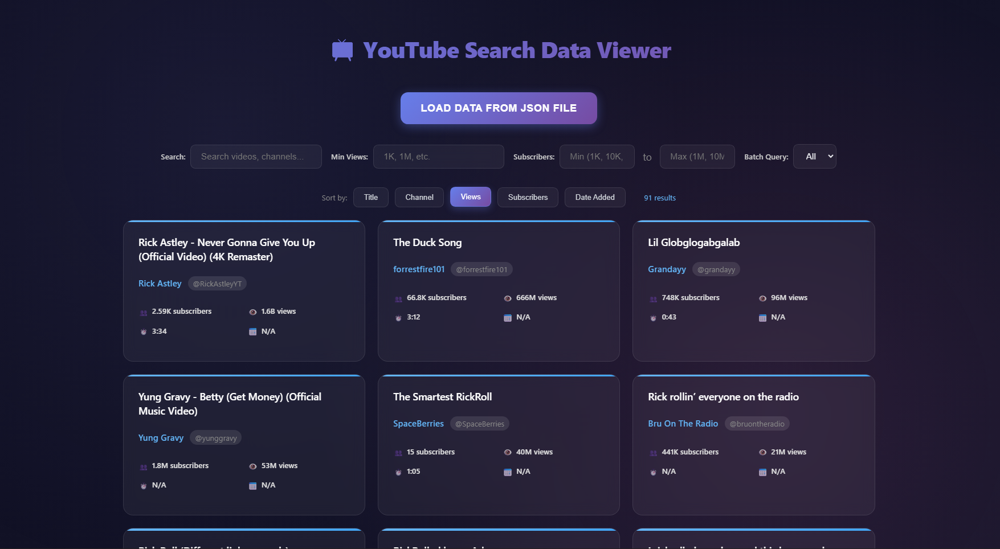

# YouTube Search Scraper


A Chrome extension for scraping and managing YouTube search results with modern UI design and batch processing capabilities.

## Features

### 🔍 **Search Result Scraping**
- Scrape YouTube search results with detailed metadata
- Extract video titles, channels, subscriber counts, views, duration, and upload dates
- Real-time data collection as you browse

### 📊 **Export Management** 
- Maintain a persistent export list across sessions
- Add current search results to your export collection
- Export data as JSON format for analysis
- Duplicate detection to avoid redundant entries

### 🤖 **Auto-Scroll Functionality**
- Automatic page scrolling to load more results
- Real-time data updates during scrolling
- Start/stop controls for flexible usage

### 📦 **Batch Processing**
- Process multiple search queries automatically
- Configure videos per search (1-100)
- Navigate through searches automatically
- Comprehensive progress tracking

### 🎨 **Modern UI Design**
- Clean, contemporary dark theme
- Glass morphism effects with backdrop blur
- Smooth animations and transitions
- Responsive button states and interactions
- Gradient accents and modern typography

## Screenshots

| Main Interface | Data Viewer |
|---|---|
|  |  |
| *Extension popup with search results* | *Standalone data viewer interface* |

## Installation

1. **Download the Extension**
   ```bash
   git clone [repository-url]
   cd vibe_coding_influencers_db
   ```

2. **Load in Chrome**
   - Open Chrome and go to `chrome://extensions/`
   - Enable "Developer mode" (toggle in top right)
   - Click "Load unpacked"
   - Select the extension folder
   - The extension icon should appear in your toolbar

## Usage

### Basic Scraping

1. **Navigate to YouTube**
   - Go to [YouTube](https://youtube.com)
   - Perform a search for your desired content

2. **Open Extension**
   - Click the extension icon in your toolbar
   - The popup will automatically load current page data

3. **View Results**
   - See new items found on the current page
   - Review video details including metadata
   - Check your persistent export list count

### Export Management

- **Add Current Results**: Click "Add Current" to append new items to your export list
- **Export Data**: Click "Export as JSON" to download your collected data
- **Clear Lists**: Use "Clear" buttons to reset current results or export list

### Auto-Scroll Mode

1. Click "Auto-Scroll" to start automatic scrolling
2. The extension will continuously scroll and collect new results
3. Data updates every 3 seconds during scrolling
4. Click "Stop" to halt auto-scrolling

### Batch Scraping

1. **Open Batch Section**
   - Click "Show" next to "Batch Scrape"

2. **Configure Batch**
   - Enter search queries (one per line)
   - Set videos per search (1-100)
   
3. **Run Batch**
   - Click "Start Batch" to begin processing
   - Monitor progress in real-time
   - Results automatically added to export list

## File Structure

```
├── manifest.json         # Extension configuration
├── popup.html           # Main popup interface
├── popup.js            # Popup logic and UI handling
├── content.js          # Page content scraping script
├── viewer.html         # Data visualization interface
└── README.md          # This file
```

## Technical Details

### Permissions Required
- `activeTab` - Access current browser tab
- `scripting` - Inject content scripts
- `storage` - Persist export list data
- `https://www.youtube.com/*` - YouTube domain access

### Data Storage
- Export lists stored in Chrome's local storage
- Persistent across browser sessions
- Automatic duplicate detection by video ID

### Browser Compatibility
- Chrome (Manifest V3)
- Chromium-based browsers

## Data Format

Exported JSON contains video objects with the following structure:

```json
{
  "title": "Video Title",
  "channel": "Channel Name", 
  "channelHandle": "@channelhandle",
  "videoId": "unique_video_id",
  "subscribers": "100K",
  "views": "1.2M", 
  "length": "10:30",
  "uploadDate": "2 days ago",
  "addedAt": "2024-01-01T12:00:00.000Z",
  "batchQuery": "search term"
}
```

## Development

### Local Development
1. Make changes to source files
2. Go to `chrome://extensions/`
3. Click refresh icon on the extension card
4. Test changes in the popup

### Code Structure
- **popup.js** - Main extension logic, UI interactions, batch processing
- **content.js** - DOM scraping, page interaction, scroll automation  
- **popup.html** - UI layout and styling
- **viewer.html** - Standalone data viewer interface

## Contributing

1. Fork the repository
2. Create a feature branch
3. Make your changes
4. Test thoroughly
5. Submit a pull request

## License

This project is open source and available under the [MIT License](LICENSE).
